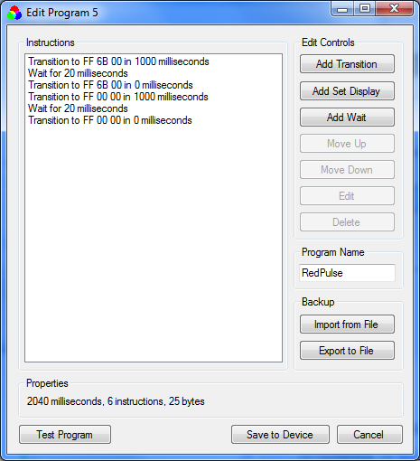
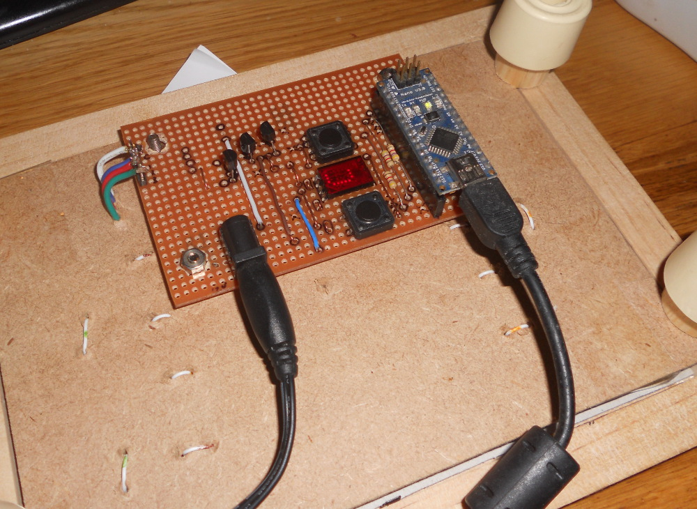
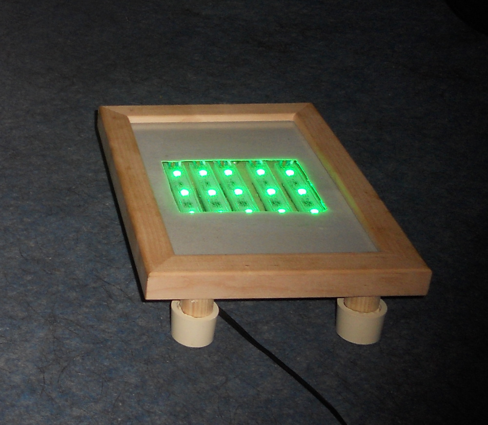

# lightprogram

Arduino-powered multi-colour light with C#/Windows Forms programming
application. This is my first attempt at developing an application 
with the .NET framework.

The Arduino controls a bank of fifteen RGB LEDs. The LED light output
is pulse-width modulated, allowing (potentially) 16 million different
colours to be produced. The PC application allows a user to create
and store lighting programs on the Arduino.

The software:

The hardware:

The buttons select one of eight stored programs when the light is not
connected to the PC. The display shows the number of the currently selected
program, but may also be used to display debugging information.

Power comes from a standard 12VDC supply. The LED modules used 
are 5050 LED strips. The device sits inside an old picture frame.

